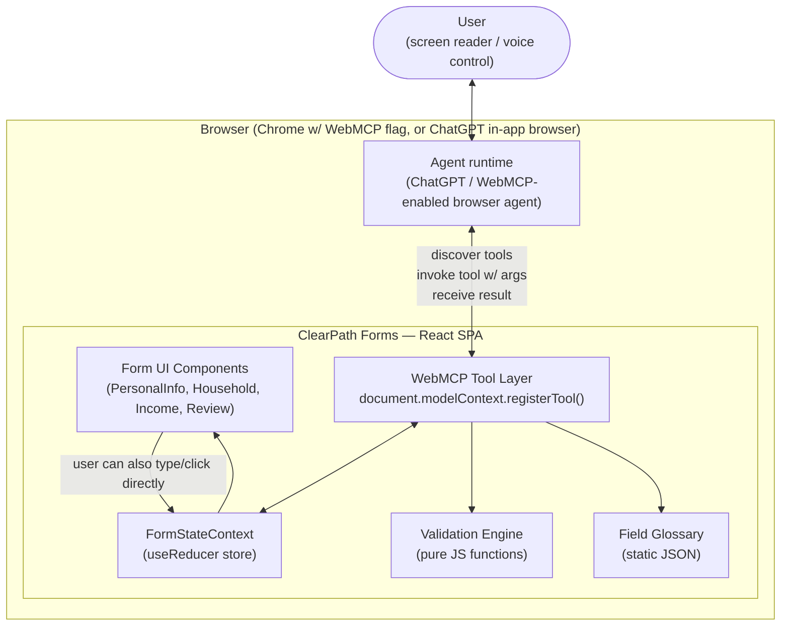
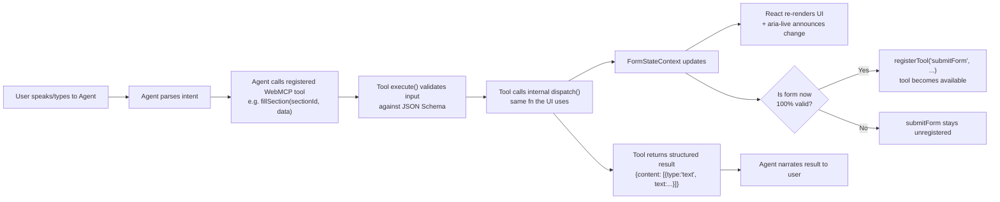
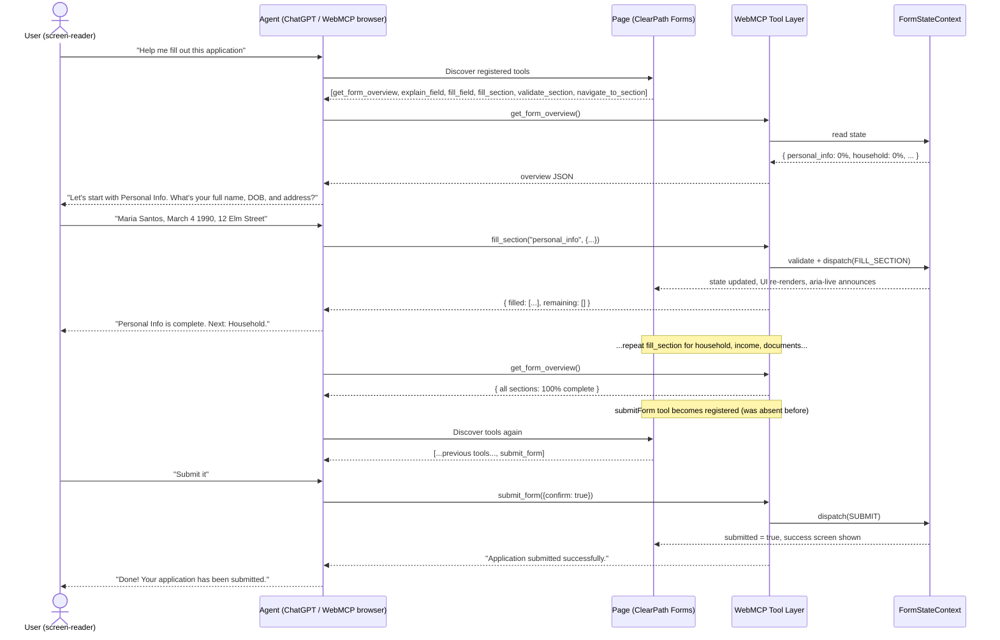
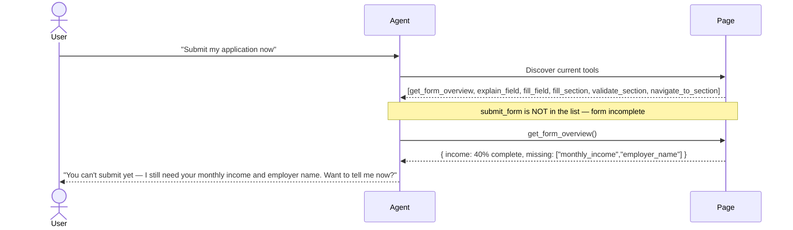

# ClearPath Forms
### WebMCP-Native Accessible Form-Filling Copilot
**Full BA / PM / Solution Architecture Plan — WebMCP Challenge Submission**

Prepared for: Devpost "The WebMCP Challenge" (OpenAI)
Submission deadline: **Sep 3, 2026, 1:00pm PT**
Document owner: You (Founder / Solo builder, AI-assisted)

---

## 0. One-line pitch

> A public-benefits-style application form that a screen-reader user, motor-impaired user, or non-native English speaker can complete entirely by talking to their AI agent — because the page itself declares real, callable actions via WebMCP, instead of the agent guessing at a UI it can't reliably see.

**The one sentence judges must remember:** Agents can already click and type on any form. ClearPath is not “AI fills a form.” It is a page that **declares** what the agent may do — and **withholds** `submit_form` until every required field is valid — so incomplete packets cannot be submitted by capability, not by hoping the model “checks first.”

### Document status (as of Sun Aug 30, 2026, late afternoon)

| Item | Status |
|---|---|
| Architecture in this file | Original plan **kept in full** below; this update **adds** shipped reality, storytelling, founder tasks, and video/camera notes |
| App (Vite + React, 4 sections, 7 tools, gated `submit_form`) | **Shipped** on GitHub + Vercel |
| Live URL | https://clear-path-forms.vercel.app |
| Repo | https://github.com/BennedictQuanTon/ClearPath-Forms (public, MIT `LICENSE`) |
| Judge-facing polish (no red errors on empty form, section % on required fields only, on-page `submit_form` badge, last-action log, greppable `document.modelContext.registerTool`) | **Coded locally** on `feature/webmcp-form-mvp` — **not on Vercel until commit + push + merge to `main`** |
| Demo video / Devpost submit | **Founder** — not done |
| Extra forms / backend / i18n | Still **out of scope** (founder confirmed: one MVP form; other sites do not get these tools) |
| Teammate test guide | **§15** in this file — Vercel URL + ChatGPT steps |

---

## 1. Business Case (BA)

### 1.1 Problem statement
Long bureaucratic web forms (benefits applications, rental applications, government intake forms) are a well-documented pain point for:
- **Blind/low-vision users** relying on screen readers, who must navigate field-by-field through poorly-labeled, multi-page forms.
- **Motor-impaired users**, for whom many small clicks/keystrokes across many fields is physically taxing.
- **Non-native speakers**, who struggle with legal/bureaucratic jargon embedded in field labels and help text.

Existing "AI form filler" products (RPA browser extensions, PDF autofillers) work by *scraping* the DOM or a PDF — they guess at structure, they're brittle, and they are not part of any open web standard. WebMCP flips this: **the page itself declares what an agent can do**, with typed schemas, so there's no guessing.

The W3C WebMCP Community Group has an **open, unresolved issue (opened Jan 2026)** explicitly asking the community to develop accessibility use cases for WebMCP. As of this plan, no concrete public reference implementation exists. This is our whitespace and our judging-criteria hook (Potential Impact + Creativity).

**Storytelling (do not pitch “we invented autofill”):**
- **Before:** Maria tabs field-by-field for 45+ minutes; jargon like “household composition” is opaque; a computer-use agent can still **press Submit** on a half-empty form.
- **After:** Maria speaks once per section; `explain_field` answers from the **page glossary**, not Wikipedia; `fill_section` writes the same store the UI uses; if the packet is incomplete, **`submit_form` is not in the tool list**.
- **What we are not claiming:** that other websites magically get ClearPath tools. WebMCP is **per page**. A random IRS/Google Form has no `registerTool` of ours — the agent may still scrape/click, which is exactly the brittle path we contrast.
- **Official theme fit ([openai.com/webmcp-challenge](https://openai.com/webmcp-challenge/), Devpost rules):** humans and agents on the **same live page**; tools declared so agents do not guess the UI. Stage One is pass/fail on theme + real WebMCP — this product is a human-fillable form **plus** agent tools, not a headless bot.

### 1.2 Stakeholders / Personas

| Persona | Role | Need | Pain today |
|---|---|---|---|
| **Maria** (primary) | Low-vision screen-reader user applying for public benefits | Complete a 4-section application without fighting the UI | 45+ min, frequent field-order confusion, no idea what "household composition" means |
| **Anh** (secondary) | Non-native English speaker | Understand what each field is really asking | Legal/bureaucratic phrasing is opaque |
| **David** (secondary) | Motor-impaired user, uses voice control | Fill form without many discrete clicks | Every checkbox/dropdown is a separate physical action |
| **Judges** (evaluator persona — treat as a stakeholder!) | Hackathon judges | See a real, working, non-trivial WebMCP implementation in <3 min | Skeptical of shallow "wraps one API call" demos |

### 1.3 Success criteria (tied directly to Devpost judging rubric)

| Judging criterion | How this project satisfies it |
|---|---|
| WebMCP Leverage | 7+ distinct tools, **dynamically registered/unregistered** based on form state (not just registered once at page load) |
| Execution | A fully working, polished, multi-section form — not a proof of concept |
| Potential Impact | Named personas, a real documented gap (W3C's own open issue), concrete before/after story |
| Creativity & Ambition | Accessibility-as-the-point, not accessibility-as-an-afterthought; differs from official showcase (3D modeling, doc collab, crossword, itinerary, DuckDB) |

**How we now make those criteria *visible* in &lt;90 seconds (added for Execution + video, not extra tools):**

| Criterion | Extra evidence on the page (post-polish) |
|---|---|
| WebMCP Leverage | On-page badge: `submit_form: not registered` vs `registered`; list of currently offered tool names; source contains literal `document.modelContext.registerTool` (Official Rules quote this shape) |
| Execution | Empty form is clean (errors only after touch / agent fill / validate); income empty shows **0%** not 20%; after submit, copy explains the tool was **unregistered so it cannot be sent twice** — not “0 required items” |
| Potential Impact | Header bullets: without WebMCP vs with; “ask household composition then try submit while empty” |
| Creativity | Video **camera** must hit the badge on the negative path — otherwise judges hear “AI form filler” and score Creativity as a mashup |

### 1.4 Scope

**In scope (MVP — must ship):**
- One realistic multi-section mock form ("Public Assistance Application" — Personal Info, Household, Income, Documents & Review)
- 7 WebMCP tools covering: read state, explain field, fill field, fill section, validate, navigate, submit
- Full keyboard/screen-reader-accessible UI as the *baseline* (WebMCP is additive, not a replacement for real a11y — say this explicitly in your submission text)
- Deployed live on Netlify or Vercel
- 3-min demo video showing a screen-reader-style flow start to finish

**Out of scope (do NOT attempt in 4 days):**
- Real backend/database persistence (use in-memory + browser storage only)
- User auth/accounts
- Real government API integration
- File upload handling beyond a mocked step
- Multi-language i18n (mention it's a natural extension, don't build it)
- Declarative API (HTML form annotations) — use Imperative API only (`document.modelContext.registerTool`)

**Founder requirements captured this round (additions, not replacements):**
- Submit **later**; polish first so top-10 has a **basis** (gated submit + a11y story), not a second form.
- Founder does what the agent cannot: Devpost join/submit, GitHub About (MIT + Website URL), YouTube public video **in English** with narration, VoiceOver pass, ChatGPT in-app browser (or Codex browsing the live URL — same idea: agent + page, not Codex “What should we build?”).
- Inspector + Gemini API key are **dev-only**; stakeholders and judges **talk to ChatGPT/Codex on the live page**.
- Hosting: **Vercel** (`clear-path-forms.vercel.app`); production branch should be **`main`** after merge.
- Demo video still uses the **same spoken prompts** as the original script; the **new** work is pointing the camera at the badge and last-action log.

**Shipped in-scope extras (still one form):**
- `Reset demo` and `Load complete demo applicant` (Maria Santos) for judges
- `localStorage` persistence of mock answers
- Tool Inspector path + real agent path both documented

---

## 2. Use Cases (formal)

### UC-01: Agent explains a confusing field
- **Actor:** Maria (via her agent)
- **Precondition:** Form loaded, "Household" section active
- **Main flow:**
  1. User says to agent: "What does 'household composition' mean?"
  2. Agent discovers `explainField` tool is registered for the active section
  3. Agent calls `explainField({ fieldId: "household_composition" })`
  4. Tool returns plain-language explanation + example
  5. Agent relays answer to user in natural language
- **Postcondition:** No state change; informational only
- **Tool used:** `explainField` (read-only, `readOnlyHint: true`)

### UC-02: Agent fills a whole section from natural language
- **Actor:** Maria
- **Precondition:** "Personal Info" section active and incomplete
- **Main flow:**
  1. User tells agent their name, DOB, address in one sentence
  2. Agent calls `fillSection({ sectionId: "personal_info", data: {...} })`
  3. Tool validates each field, writes to app state, updates UI live
  4. Tool returns `{ success: true, filledFields: [...], remainingRequired: [...] }`
  5. Agent tells user what's done and what's still missing
- **Alternate flow:** Validation fails on one field (e.g. malformed date) → tool returns field-level error → agent asks user to clarify just that field
- **Postcondition:** Section partially/fully filled; UI reflects new values live
- **Tool used:** `fillSection`

### UC-03: Agent checks overall completion status
- **Actor:** Any user
- **Main flow:** Agent calls `getFormOverview()` any time → returns section-by-section completion %, list of outstanding required fields
- **Tool used:** `getFormOverview` (read-only, always registered)

### UC-04: Agent attempts submission (gated)
- **Actor:** Maria
- **Precondition:** All required fields across all sections pass validation
- **Main flow:**
  1. `submitForm` tool is **only registered** once `getFormOverview` internally reports 100% valid completion — this is the dynamic-registration showcase moment
  2. User: "Submit my application"
  3. Agent calls `submitForm({ confirm: true })`
  4. Tool runs final validation pass, locks the form, shows success state
- **Alternate flow:** If `submitForm` isn't registered yet (form incomplete), agent literally cannot call it — the agent's tool list won't include it, so it must fall back to explaining what's missing. **This is your strongest "genuine, non-trivial WebMCP implementation" evidence for judges.**
- **Tool used:** `submitForm` (conditionally registered/unregistered)

### UC-05: Agent navigates the user through sections
- **Actor:** David (motor-impaired, voice-only)
- **Main flow:** User says "next section" → agent calls `navigateToSection({ sectionId: "income" })` → UI scrolls/focuses that section, screen reader announces new landmark
- **Tool used:** `navigateToSection`

---

## 3. Functional Requirements

| ID | Requirement | Priority |
|---|---|---|
| FR-01 | Multi-section form UI (4 sections) with native HTML semantics (labels, fieldsets, aria-live regions) | Must |
| FR-02 | `registerTool` calls scoped to component lifecycle (register on mount, unregister on unmount via `AbortController`) | Must |
| FR-03 | Central form-state store (React Context) as single source of truth read/written by both UI and tools | Must |
| FR-04 | Field-level + section-level validation with plain-language error messages | Must |
| FR-05 | `submitForm` tool dynamically appears only when form is fully valid | Must |
| FR-06 | Visual + ARIA live-region feedback whenever a tool mutates state (so a *sighted* observer in the demo video can see the agent acting) | Must |
| FR-07 | Works correctly when tested via Chrome `chrome://flags/#enable-webmcp-testing` and ChatGPT in-app browser | Must |
| FR-08 | Reset/demo-data button so judges can quickly re-test | Should |
| FR-09 | Field explanations pulled from a small static glossary object | Should |

## 4. Non-Functional Requirements

- **Accessibility baseline:** WCAG 2.1 AA on the underlying HTML (semantic elements, labels, focus management) — required both ethically and because your own submission text claims accessibility as the value prop; judges may check.
- **Performance:** Static SPA, sub-2s load, no backend round-trip latency.
- **Security:** No real PII collected/stored; clearly mock data; no external write APIs.
- **Portability:** Deployed to a public URL, no login wall (or documented test credentials if you add one).

---

## 5. Solution Architecture

### 5.1 Stack

| Layer | Choice | Why |
|---|---|---|
| Framework | React + Vite | Fast scaffold, good WebMCP examples use it, hooks map cleanly to tool lifecycle |
| State | React Context + `useReducer` | Single source of truth, easy for tools to read/write |
| Styling | Plain CSS or Tailwind (utility only, no compiler needed if using CDN Tailwind) | Speed |
| WebMCP | `document.modelContext.registerTool()` (Imperative API) | Current stable surface; declarative API not mature enough |
| Hosting | Netlify (use the challenge's free credits) or Vercel | Both explicitly supported by the hackathon, fast deploy |
| Repo | GitHub, public, MIT or Apache-2.0 license file at root, visible in About section | **Hard submission requirement** |

### 5.2 Component / architecture diagram



**Key architectural principle (from the WebMCP spec's own guidance):** tools do **not** duplicate business logic. Every `execute()` function calls the *same* dispatch functions the manual UI uses (e.g. clicking "Save Section" and the agent calling `fillSection` both go through `dispatch({type: 'FILL_SECTION', payload})`). This is what makes it a "genuine, non-trivial implementation" rather than a fake wrapper.

### 5.3 Data model

```ts
// Single source of truth
interface FormState {
  sections: {
    personal_info: SectionState;
    household: SectionState;
    income: SectionState;
    documents: SectionState;
  };
  submitted: boolean;
  activeSection: SectionId;
}

interface SectionState {
  fields: Record<string, FieldValue>;
  errors: Record<string, string>;   // plain-language error text
  isComplete: boolean;               // all required fields valid
}

type FieldValue = string | number | boolean | null;
```

### 5.4 Data flow (step-by-step)



---

## 6. WebMCP Tool Specifications (build these exactly)

> All tools registered inside `useEffect` hooks scoped to the relevant component, unregistered via `AbortController` on unmount — per the spec's recommended pattern (this avoids "ghost tools" and is itself a signal of quality to judges/inspectors).

**Implementation note (shipped):** Chrome’s Imperative API `execute` returns a **string** (see Chrome WebMCP docs). The snippets in this section still show the original `{ content: [{ type: "text", ...}] }` shape from the first draft; the running app stringifies JSON for the agent. Registration uses `document.modelContext.registerTool(tool, { signal })` with `navigator.modelContext` as fallback. `submit_form` is omitted when `submitted === true` as well as when the form is invalid.

### 6.1 `getFormOverview` — always registered (top-level App component)
```js
document.modelContext.registerTool({
  name: "get_form_overview",
  description: "Get the current completion status of the application: which sections are done, which required fields remain across the whole form.",
  inputSchema: { type: "object", properties: {} },
  annotations: { readOnlyHint: true },
  execute: async () => {
    const overview = buildOverview(state); // pure fn over context state
    return { content: [{ type: "text", text: JSON.stringify(overview) }] };
  }
});
```

### 6.2 `explainField` — registered per active section
```js
document.modelContext.registerTool({
  name: "explain_field",
  description: "Explain in plain language what a specific form field is asking for, including an example answer.",
  inputSchema: {
    type: "object",
    properties: { fieldId: { type: "string", description: "e.g. 'household_composition'" } },
    required: ["fieldId"]
  },
  annotations: { readOnlyHint: true },
  execute: async ({ fieldId }) => {
    const entry = glossary[fieldId];
    if (!entry) return { content: [{ type: "text", text: "No explanation found for that field." }] };
    return { content: [{ type: "text", text: `${entry.plainLanguage} Example: ${entry.example}` }] };
  }
});
```

### 6.3 `fillField`
```js
document.modelContext.registerTool({
  name: "fill_field",
  description: "Set the value of a single field in the currently active section.",
  inputSchema: {
    type: "object",
    properties: {
      fieldId: { type: "string" },
      value: { type: "string" }
    },
    required: ["fieldId", "value"]
  },
  annotations: { readOnlyHint: false },
  execute: async ({ fieldId, value }) => {
    const result = validateAndDispatch(fieldId, value); // reuses UI's own validator
    return { content: [{ type: "text", text: JSON.stringify(result) }] };
  }
});
```

### 6.4 `fillSection`
```js
document.modelContext.registerTool({
  name: "fill_section",
  description: "Fill multiple fields in the active section at once from structured data extracted from natural language.",
  inputSchema: {
    type: "object",
    properties: {
      sectionId: { type: "string", enum: ["personal_info","household","income","documents"] },
      data: { type: "object", description: "Map of fieldId -> value" }
    },
    required: ["sectionId", "data"]
  },
  execute: async ({ sectionId, data }) => {
    const result = fillSectionBulk(sectionId, data);
    return { content: [{ type: "text", text: JSON.stringify(result) }] };
  }
});
```

### 6.5 `validateSection`
```js
// read-only re-check, useful when agent wants to confirm before moving on
document.modelContext.registerTool({
  name: "validate_section",
  description: "Check a section for validation errors and return plain-language messages.",
  inputSchema: { type: "object", properties: { sectionId: { type: "string" } }, required: ["sectionId"] },
  annotations: { readOnlyHint: true },
  execute: async ({ sectionId }) => ({
    content: [{ type: "text", text: JSON.stringify(getSectionErrors(sectionId)) }]
  })
});
```

### 6.6 `navigateToSection`
```js
document.modelContext.registerTool({
  name: "navigate_to_section",
  description: "Move the user's focus to a different section of the form (also announced via screen reader landmark).",
  inputSchema: { type: "object", properties: { sectionId: { type: "string" } }, required: ["sectionId"] },
  execute: async ({ sectionId }) => {
    dispatch({ type: "SET_ACTIVE_SECTION", sectionId });
    focusSectionHeading(sectionId); // moves DOM focus, screen readers announce it
    return { content: [{ type: "text", text: `Moved to section: ${sectionId}` }] };
  }
});
```

### 6.7 `submitForm` — dynamically registered/unregistered (THE showcase tool)
```js
useEffect(() => {
  const controller = new AbortController();
  if (isEntireFormValid(state)) {
    document.modelContext.registerTool({
      name: "submit_form",
      description: "Submit the completed application. Only callable once all required fields across all sections are valid.",
      inputSchema: {
        type: "object",
        properties: { confirm: { type: "boolean", description: "Must be true to submit" } },
        required: ["confirm"]
      },
      annotations: { readOnlyHint: false },
      execute: async ({ confirm }) => {
        if (!confirm) return { content: [{ type: "text", text: "Submission requires explicit confirmation." }] };
        dispatch({ type: "SUBMIT" });
        return { content: [{ type: "text", text: "Application submitted successfully." }] };
      }
    }, { signal: controller.signal });
  }
  return () => controller.abort(); // unregisters when form becomes invalid again
}, [state]);
```

---

## 7. Sequence Diagram — Full happy-path session



## 8. Sequence Diagram — Gated submission (negative path, proves real logic)



---

## 9. Build Plan — Day by Day (from Aug 30 → Sep 3, 1pm PT deadline)

> You have roughly **4 working days**. Budget generously for the demo video and submission form on the last day — many teams lose points by rushing this.

### Day 1 (Sat Aug 30 – today)
- [ ] Register on Devpost (`webmcp.devpost.com` → Join Hackathon)
- [ ] Set up Chrome 149+ with `chrome://flags/#enable-webmcp-testing`, and/or ChatGPT desktop app
- [ ] Create GitHub repo, add MIT/Apache-2.0 LICENSE file (must be visible in repo "About" section)
- [ ] Scaffold Vite + React app
- [ ] Build `FormStateContext` + reducer with the 4-section data model above
- [ ] Get ONE tool (`get_form_overview`) registering and callable end-to-end, verified with the **Model Context Tool Inspector** Chrome extension
- [ ] (Optional) Submit Netlify credit request form if not done — **due Sep 1, 12pm PT**

**Progress log (original checkboxes above are unchanged):**
- Day 1–3 engineering: **done** (scaffold, 4 sections, 7 tools, gated submit, Vercel live, Inspector + agent fill of Maria’s name verified).
- Day 4 polish (badge, agent log, empty-form UX, README Devpost/video copy): **coded, pending git push**.
- Day 4 video + Devpost: **founder, pending**. Codex “What should we build?” is **not** the demo; ChatGPT/Codex **in-app browser on the Vercel URL** is.

### Day 2 (Sun Aug 31)
- [ ] Build all 4 section UI components with full semantic HTML/ARIA
- [ ] Implement validation engine (pure functions, reused by both UI and tools)
- [ ] Implement `explain_field` + glossary JSON (write ~15 plain-language field explanations)
- [ ] Implement `fill_field` and `fill_section`
- [ ] Manually test each tool via the Tool Inspector extension

### Day 3 (Mon Sep 1)
- [ ] Implement `validate_section`, `navigate_to_section`
- [ ] Implement dynamic `submit_form` registration/unregistration logic — test both paths (UC-04 happy + negative)
- [ ] Deploy to Netlify/Vercel, confirm live URL works
- [ ] Full run-through test in **ChatGPT's in-app browser** (this is what judges will actually use)
- [ ] Fix bugs found in real agent testing (schemas are often subtly wrong — check error messages)

### Day 4 (Tue Sep 2) — polish + submission prep
- [ ] Visual polish pass (this feeds "Execution" score)
- [ ] Add a "Reset demo data" button for judges
- [ ] Write submission text description (see §11 below)
- [ ] Record demo video (script below), upload to YouTube as public
- [ ] Finalize README (setup instructions, architecture summary, link to this doc if you want)
- [ ] Submit **early**, don't wait for Sep 3 1pm PT deadline — leave buffer for upload/platform issues

### Buffer (Wed Sep 3, morning, before 1pm PT)
- [ ] Final live-URL smoke test
- [ ] Double check repo license is visible in GitHub "About" panel
- [ ] Confirm submission form fields are all filled (see checklist §12)

---

## 10. Testing / QA Plan

| Test | Method |
|---|---|
| Tool schema correctness | Model Context Tool Inspector extension — call each tool manually, verify schema/response |
| Real agent behavior | ChatGPT desktop app in-app browser, natural-language prompts per each use case (UC-01 to UC-05) |
| Screen reader smoke test | Turn on NVDA (free) or macOS VoiceOver, tab through the form manually without an agent — confirms your accessibility baseline claim is true, not just marketing |
| Dynamic registration | Verify `submit_form` is genuinely absent from the tool list until form is valid — screenshot this for your submission text as proof |
| On-page gating (polish) | Same fact as dynamic registration, but film the **badge** so judges who never open Inspector still see it |
| Negative paths | Malformed input to `fill_field`, incomplete `fill_section`, premature `submit_form` call |

---

## 11. Submission Text Description — outline to fill in

Structure exactly per Devpost's required fields:

1. **Why WebMCP fits:** Cite the open W3C accessibility issue (#65) directly — you're building toward something the spec authors publicly asked for.
2. **Better UX:** Contrast with DOM-scraping/RPA competitors (rtrvr.ai, Instafill) — you don't guess, you declare.
3. **What's newly possible:** A screen-reader user can now complete a multi-section bureaucratic form via one conversation instead of dozens of manual field-by-field navigations; the agent literally cannot submit an incomplete form because the tool doesn't exist yet — safety by design, not by prompting.
4. **How you implemented WebMCP:** 7 tools, Imperative API, dynamic register/unregister tied to form validity, reused business logic shared between UI and tools.

### 11.1 Paste-ready Devpost copy (English — filled from the shipped product)

Use this in addition to the four-point outline above. Edit only if the live app changes.

**Why your use case is a strong fit for WebMCP**  
The W3C WebMCP Community Group has an open accessibility issue asking for concrete use cases. Long benefits-style forms are a documented failure mode for screen-reader and motor-impaired users: dozens of fields, legal jargon, and a submit control that still works when the form is incomplete. WebMCP fits because the page can declare what an agent may do (`explain_field`, `fill_section`) and **withhold** `submit_form` until validation passes. That is a capability DOM-scraping cannot express.

**How it creates a better user experience**  
The applicant talks once per section instead of tabbing field-by-field. Jargon is answered from a glossary **on the page**, not from a generic model guess. Sighted users see the form update live; the **last action** and **submit_form registered / not registered** badge make the contract visible without opening DevTools. Manual typing and agent tools share one React reducer, so the UI never disagrees with the agent.

**What people and agents can do together that was difficult or impossible before**  
Together they can complete a multi-section bureaucratic form in one conversation **and** be structurally unable to submit an incomplete packet: if required fields are missing, `submit_form` is not in the agent’s tool list. Previously, an agent using computer-use could still press Submit; the user had to hope the model checked first.

**How you implemented WebMCP**  
Seven tools via the Imperative API (`document.modelContext.registerTool`), registered in React effects and unregistered with `AbortController`. Read-only: `get_form_overview`, `explain_field`, `validate_section`. Mutating: `fill_field`, `fill_section`, `navigate_to_section`. `submit_form` is registered only when `isEntireFormValid` is true. Hosted on Vercel; no backend; mock data only. Chrome’s Imperative `execute()` returns a **string** (typically JSON text); tool `description` fields are written so ChatGPT/Codex choose tools instead of guessing.

## 12. Submission Checklist (map to official rules)

- [ ] Live working URL (Netlify/Vercel), testable in ChatGPT browser or WebMCP Chrome
- [ ] Public GitHub repo with all source + setup instructions
- [ ] License file visible in repo "About" section
- [ ] Repo contains actual `document.modelContext.registerTool(...)` code (required by rules, literally quoted in Official Rules)
- [ ] Demo video: <3 min, public YouTube, audio narration, no copyrighted music/trademarks
- [ ] Text description covering all 4 required points above
- [ ] Submitted via `webmcp.devpost.com` before Sep 3, 1:00pm PT
- [ ] (Added) GitHub About shows MIT + Website set to the Vercel URL
- [ ] (Added) Video narration in **English**; include one agent **Allow** tap if ChatGPT asks
- [ ] (Added) Polish commit is on the **live** URL before filming if you want badge/log shots

## 13. Risk Register

| Risk | Likelihood | Mitigation |
|---|---|---|
| Chrome WebMCP flag behaves differently than ChatGPT browser | Medium | Test in both environments by Day 3, not just at the end |
| Agent doesn't call tools as expected (schema ambiguity) | Medium | Write very explicit `description` fields — this is the #1 real-world failure mode per WebMCP dev guides |
| Time runs out before video/submission text | High if untracked | Hard-block Day 4 for polish + submission only, no new features |
| Judges test manually and something breaks live | Medium | Add the "Reset demo data" button; keep the happy path bulletproof even if edge cases have minor bugs |
| Accessibility claim doesn't hold up under scrutiny | Low-Medium | Actually test with a real screen reader once, don't just assume semantic HTML is enough |
| Polish lives only on laptop (not Vercel) | High until push | Founder must commit/push/merge before filming the badge; otherwise video shows the first deploy |

## 14. Demo Video Script (≈2:45)

1. **0:00–0:20** — Cold open: show the form, say the problem in one sentence ("Long bureaucratic forms are hard to navigate with a screen reader — here's what changes when the page can talk to your agent instead of your agent guessing at the page.")
2. **0:20–1:30** — Live demo: open ChatGPT browser, ask agent to fill Personal Info + Household via natural language, show UI updating live, show `explain_field` answering a jargon question
3. **1:30–2:00** — Show the **negative path**: ask agent to submit while incomplete, show it can't (tool isn't even registered), agent explains what's missing
4. **2:00–2:30** — Complete remaining sections, submit successfully, show `submit_form` now appears/works
5. **2:30–2:45** — Close: one sentence on WebMCP + one sentence linking to the open W3C accessibility issue you're addressing

**Camera notes (same prompts as above — this is what changed for the video vs the first MVP UI):**
- Spoken test is **unchanged** (UC-01–UC-04). You do **not** need new ChatGPT lines.
- **Must show on camera (post-polish UI):** (1) cold open of a **clean** empty form, not a wall of red errors; (2) after fill, the **Last agent or page action** log; (3) incomplete submit → **red badge** `submit_form: not registered`; (4) after Load demo / complete → **green badge** `submit_form: registered`; (5) success screen + badge that the tool unregistered.
- If you film **today’s Vercel without pushing polish**, the prompts still work; you lose the badge/log shots and the empty form looks harsher. Prefer film **after** polish is on `main`.
- Language: Official Rules require English (or an English translation) for video, description, and testing instructions.
- YouTube **Public**, &lt;3:00, **audio narration**, no copyrighted music/trademarks. ChatGPT may show an **Allow** / confirm chip before `fill_field` — that is correct WebMCP; include one Allow tap in the video.
- Inspector side panel is optional B-roll only. Gemini API key is **not** part of the stakeholder demo.

---

*End of plan. Build in this order, don't skip the negative-path testing in §10 — it's your best evidence of a "genuine, non-trivial implementation" for the WebMCP Leverage score.*


Here's a concrete "is this actually done" bar, split into (1) a scoring rubric to self-judge against, and (2) an actual test protocol you run yourself before submitting.

## Part 1: Success Rubric (self-score before you submit)

### Gate 0 — Stage One pass/fail (must clear before anything else matters)
Devpost's own Stage One is binary: does the project reasonably fit the theme, and does it reasonably use WebMCP? Self-check:
- [ ] At least one `document.modelContext.registerTool()` call exists in the shipped code (not a stub, actually wired to real logic)
- [ ] The app is about **humans + agents doing something together**, not just an agent automating something a human never touches
- [ ] It runs live, today, in ChatGPT's in-app browser or WebMCP-flagged Chrome

If any of these are "no," nothing else matters — fix this first.

### Stage Two — score yourself 1–5 on each, honestly

| Criterion | 1 (weak) | 3 (okay) | 5 (strong — your target) |
|---|---|---|---|
| **WebMCP Leverage** | One static tool registered at page load, thin wrapper around one API call | A few tools, all registered up-front, decent schemas | 5+ tools, **dynamic register/unregister** tied to real state (your `submit_form` gating), tools reuse the same logic the UI uses |
| **Execution** | Tool calls work in isolation but UI is rough/half-built | Core flow works, some rough edges | Full flow works with no dead ends, good visual/ARIA feedback, no console errors, works on a cold load |
| **Potential Impact** | Vague "this could help people" | Named use case, plausible audience | Named persona + documented real gap (your W3C issue citation) + a **before/after** that's obviously true, not just asserted |
| **Creativity & Ambition** | Looks like the official showcase examples or an obvious "form + AI" mashup | Distinct enough, one clear twist | Mechanism itself is novel (declared tools vs. DOM-scraping competitors), not just a novel vertical |

**Your submit bar: average 4+ across all four, with WebMCP Leverage and Execution both at 4+ minimum** — those two are where shallow hackathon projects get caught, and where judges spend the least charitable amount of attention.

### Hard go/no-go checklist (binary, not scored)
- [ ] Repo is public, has a LICENSE file **visible in the GitHub "About" section** (this specifically trips people up — a LICENSE file in the repo root isn't enough if About isn't set)
- [ ] Live URL loads with zero setup/login friction for a judge
- [ ] Video is under 3:00, public on YouTube, has audio narration
- [ ] Submission text answers all 4 required prompts (why WebMCP fits / better UX / what's newly possible / how you implemented it)
- [ ] You tested in the **actual judging environment** (ChatGPT in-app browser), not just your dev Chrome tab

---

## Part 2: How to self-test it (do these in this order)

### Test 1 — Schema-level sanity (no agent yet)
Install the **Model Context Tool Inspector** Chrome extension. Load your app, open the inspector, and for every registered tool:
- Confirm it appears in the tool list (proves registration succeeded)
- Manually invoke it with valid input → confirm the returned `content` is well-formed and readable
- Manually invoke it with invalid/missing input → confirm it fails gracefully, not with a silent crash
- Confirm `submit_form` is **absent** from the list when the form is incomplete, and **appears** the moment it becomes valid — this is your single most important test

### Test 2 — Real agent, real prompts (this is the actual judging condition)
Open ChatGPT desktop app's in-app browser, navigate to your live URL, and run each use case as a natural conversation — don't script exact tool names, talk like a real user would:
- "What does household composition mean?" → should trigger `explain_field`, not a generic ChatGPT guess
- "My name is Maria Santos, born March 4 1990, I live at 12 Elm Street" → should trigger `fill_section` and actually update the visible form
- "Submit my application" while incomplete → agent should be unable to, and should explain what's missing, without you ever telling it to check first
- Complete everything, then "Submit it" → should now work

If the agent answers from general knowledge instead of calling your tools, your tool `description` fields are too vague — this is the #1 real-world failure mode, fix descriptions before anything else.

### Test 3 — Cross-environment check
Repeat Test 2 in Chrome with `chrome://flags/#enable-webmcp-testing` enabled. Judges may use either. Behavior should match.

### Test 4 — Accessibility ground-truth
Turn on a real screen reader (NVDA on Windows, free; VoiceOver on Mac, built-in) and navigate the form **manually, without the agent**, tabbing through it like a blind user would. This isn't optional — your entire value proposition is an accessibility claim, and if the baseline HTML isn't actually accessible, a sharp judge who checks this will discount your Potential Impact score hard. Fix any missing labels, bad heading order, or focus traps you find.

### Test 5 — Cold-load / stranger test
Close everything, reopen the live URL fresh (simulates a judge who's never seen it), and run through the whole happy path with zero prior context. Time yourself — if it takes you more than ~90 seconds to get oriented, judges (who watch for under 3 minutes total per project) will be lost too.

### Test 6 — Negative/edge cases
- Malformed date, empty required field, weird unicode input into `fill_field`
- Calling `fill_section` with a field ID that doesn't exist
- Reload mid-form (confirm it doesn't crash, even if state resets — document that limitation rather than let it break silently)

---

**Bottom line:** if Test 1 and Test 2 both pass cleanly and your self-score table averages 4+, you're in shippable shape. Want me to append this whole section to the plan document as an appendix, or turn Test 2's prompts into a literal test script you read off while recording the demo video?

---

## Part 3 — As-built vs this original plan (additive log)

Nothing in Parts 1–2 above is deleted. This part records what exists in code and what the founder still owns.

### Stack as built
React + Vite + TypeScript, React Context + `useReducer`, plain CSS, Imperative WebMCP, Vercel, MIT, mock data + `localStorage`. Single form: Personal information, Household, Income, Documents and review.

### Tools as built (names)
`get_form_overview`, `explain_field`, `fill_field`, `fill_section`, `validate_section`, `navigate_to_section`, `submit_form` (conditional).

### UX polish vs first live deploy (why it helps top-10 **Execution / Leverage visibility**, not a new product)
- Empty form: no error spam until the field is touched, an agent fills it, or `validate_section` runs.
- Section progress % counts **required** fields only (empty Income is 0%, not 20% from an optional employer name).
- On-page **submit_form** badge + current tool names + last action log — judges who never open Inspector still see gating.
- Post-submit status explains unregistration instead of “0 required items.”
- Header how-it-works bullets (DOM guess vs declared tools vs try submit while empty).

### What did **not** change (founder asked)
- Still **one** MVP form. A “different form” on the public web **cannot** use these tools unless that page registers them.
- Demo **conversation** for the video is the same Test 2 prompts; only **what you film** on the page changed (badge/log).
- Top 10 is **not guaranteed** (~4000 Devpost participants). Strongest score lever remains gated `submit_form` + W3C a11y story + English video. Showcase apps with 20+ visual tools can still beat us on spectacle; we win on **mechanism + impact narrative**.

### Founder checklist (cannot be done in the repo alone)
- [ ] Commit + push polish; merge to `main` if Vercel production is `main`
- [ ] GitHub About: description + **MIT visible** + Website `https://clear-path-forms.vercel.app`
- [ ] Join + submit on [webmcp.devpost.com](https://webmcp.devpost.com/) with §11.1 text, repo, live URL, YouTube
- [ ] Record §14 video in English after polish is live
- [ ] VoiceOver (or NVDA) tab-through once
- [ ] After **Sep 3, 2026, 1:00pm PT**: do not edit submission, repo, or live site until winners are announced

### Eligibility reminder (Official Rules)
Open to majority-age residents of OpenAI API–supported countries; not open to listed OFAC / excluded regions. Submission materials in English. Video &lt; 3 minutes with audio. Live URL required. `registerTool` in public source. AI coding assistance is allowed; the project must remain the entrant’s original work product.

---

## 15. Hướng dẫn test cho đồng đội (ChatGPT + Vercel)

Gửi section này cho teammate. Không cần clone repo. **Nói với ChatGPT**, không nói với form, không dùng Codex “What should we build?”.

### Link

| Cái | URL |
|---|---|
| **App live (nộp bài / test agent)** | https://clear-path-forms.vercel.app |
| Repo | https://github.com/BennedictQuanTon/ClearPath-Forms |
| Challenge | https://webmcp.devpost.com/ |

Form giả (mock). Không gửi dữ liệu cơ quan nhà nước.

**Ghi chú bản:** Nếu teammate **chưa thấy** badge `submit_form: not registered` / ô Last agent action — đó là bản Vercel chưa merge polish. Tool vẫn chạy; chỉ UI khác. Sau khi founder push, hard refresh (`Cmd+Shift+R`).

---

### A. ChatGPT (cách giám khảo / demo video)

1. Cài/update **ChatGPT desktop** (Mac/Windows): https://chatgpt.com/download — **không** dùng tab Chrome để *chat*.
2. Trong app, mở **trình duyệt trong ChatGPT** (in-app browser / mở website *bên trong* app).
3. Dán: `https://clear-path-forms.vercel.app` — đợi form load (banner WebMCP nếu Chrome-flagged; trong ChatGPT banner có thể khác).
4. **Gõ vào ô chat ChatGPT** (tiếng Anh — tool description đang EN). Nếu hiện *May I enter…* / Allow → **Allow** (đúng, không phải lỗi).

Chạy **đúng thứ tự**:

**1 — Form trống** (nếu form còn data: trên trang bấm **Reset demo**):

- `What does household composition mean?`  
  Đạt: giải thích field (glossary), không bài luật generic. Form **không** cần đổi.

- `Submit my application`  
  Đạt: **không** ra màn submitted. Agent nói còn thiếu field. (`submit_form` chưa có trong tool list.)

**2 — Điền:**

- `Fill the full legal name with Maria Elena Santos`  
  Đạt: ô **Full legal name** trên trang **có chữ**. Nếu không đổi = agent chưa gọi tool.

- (Tuỳ) thêm DOB, địa chỉ bằng một câu tiếng Anh, hoặc bấm **Load complete demo applicant**.

**3 — Nộp khi đủ:**

- Bấm **Load complete demo applicant** nếu chưa full.  
- `Submit the application` / `Submit it` với confirm nếu agent hỏi.  
  Đạt: **Practice application submitted**.

**Không làm:** Gemini API key trong Inspector; Codex landing “What should we build?”; mở `127.0.0.1` trong ChatGPT (thường fail — dùng Vercel).

---

### B. Chrome + Inspector (dev, không bắt buộc cho teammate)

1. Chrome 150+ → `chrome://flags/#enable-webmcp-testing` → Enabled → Relaunch.  
2. Extension: [WebMCP – Model Context Tool Inspector](https://chromewebstore.google.com/detail/gbpdfapgefenggkahomfgkhfehlcenpd)  
3. Mở https://clear-path-forms.vercel.app → dropdown tool. Form trống: **không** có `submit_form`. Load demo → **có**. Execute `submit_form` với `{"confirm": true}`.

Ô User Prompt trong Inspector cần Gemini key — **bỏ qua**. Dùng Execute Tool.

---

### C. Checklist gửi lại founder

- [ ] ChatGPT mở được Vercel trong in-app browser  
- [ ] Câu household composition → dùng tool / glossary  
- [ ] Submit lúc trống → **fail** (đúng)  
- [ ] Tên Maria hiện trên form sau Allow  
- [ ] Load demo + submit → success  
- [ ] (Nếu có polish) thấy badge registered / not registered  

Kẹt: chụp màn hình + **nguyên câu** ChatGPT trả lời, gửi founder.